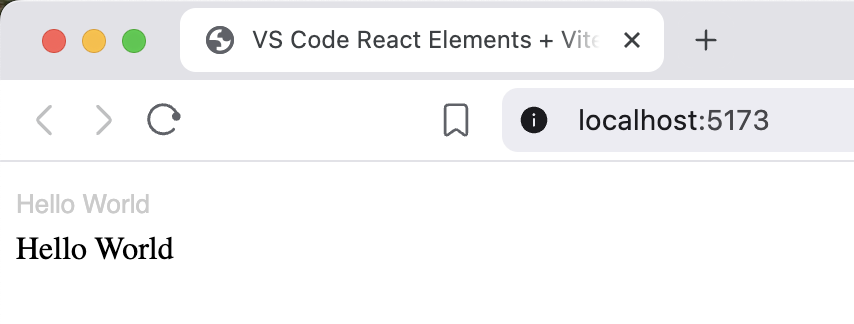

# Repro: @vscode-elements/react-elements + Vitest (jsdom)

Ref: [vscode-elements/react-elements#19](https://github.com/vscode-elements/react-elements/issues/19)

## Steps

1) Install
- `npm i`

2) Run the app
- `npm run dev`
- Open http://localhost:5137 (or the URL shown in the terminal)
- You should see “Hello World” (plain `<label>` and a [`<vscode-label>`](https://vscode-elements.github.io/components/label/))



3) Run tests
- `npm test`
- `src/VscodeLabelWrapper.test.jsx` fails with:

```
Error: Cannot find module '.../node_modules/@vscode-elements/elements/dist/includes/VscElement' imported from .../node_modules/@vscode-elements/elements/dist/vscode-tree/vscode-tree.js
```

Note: this app does not use [`<vscode-tree>`](https://vscode-elements.github.io/components/tree/).
